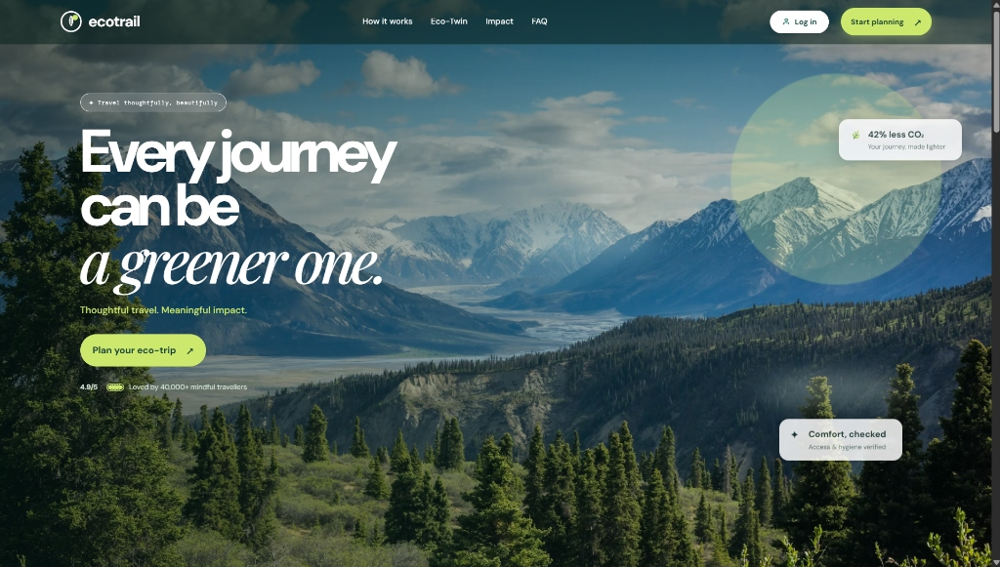
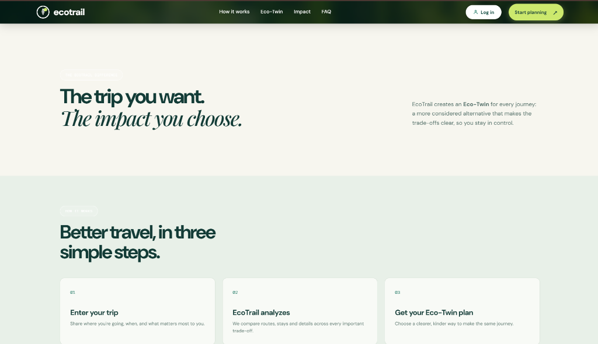
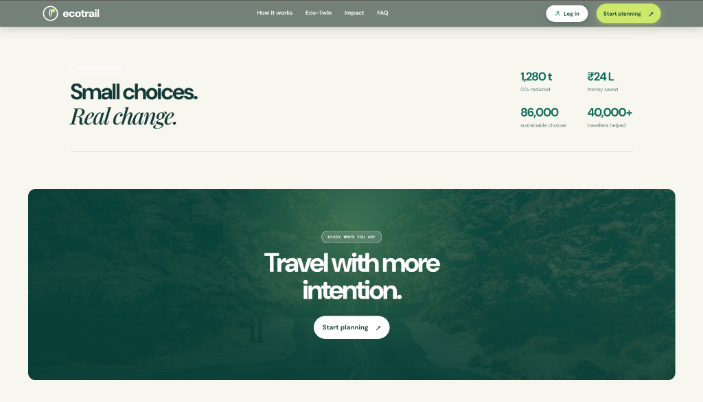
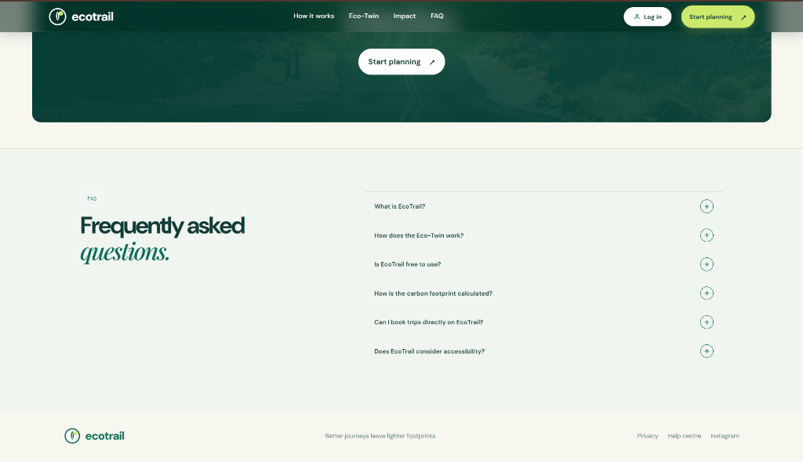
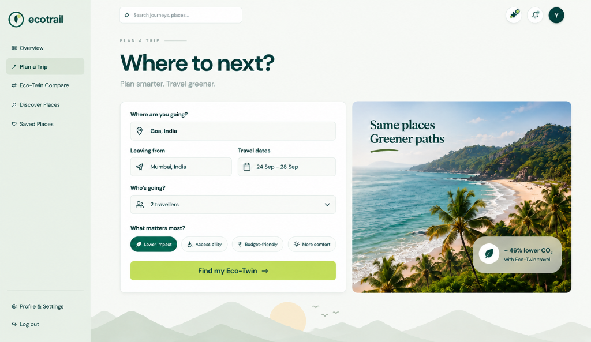
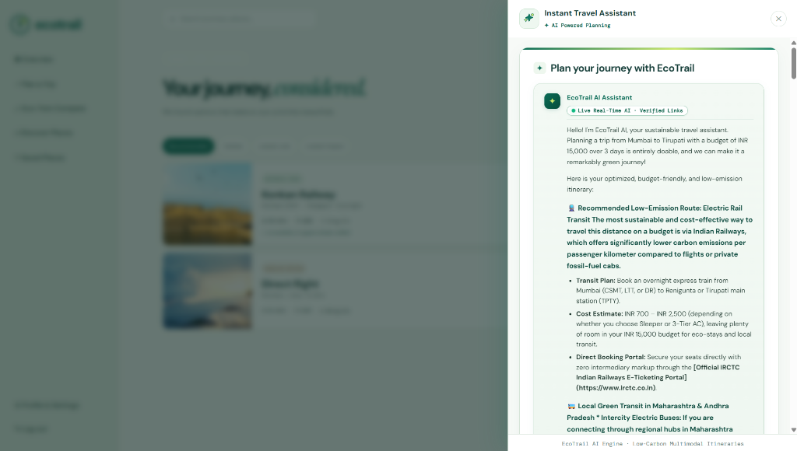
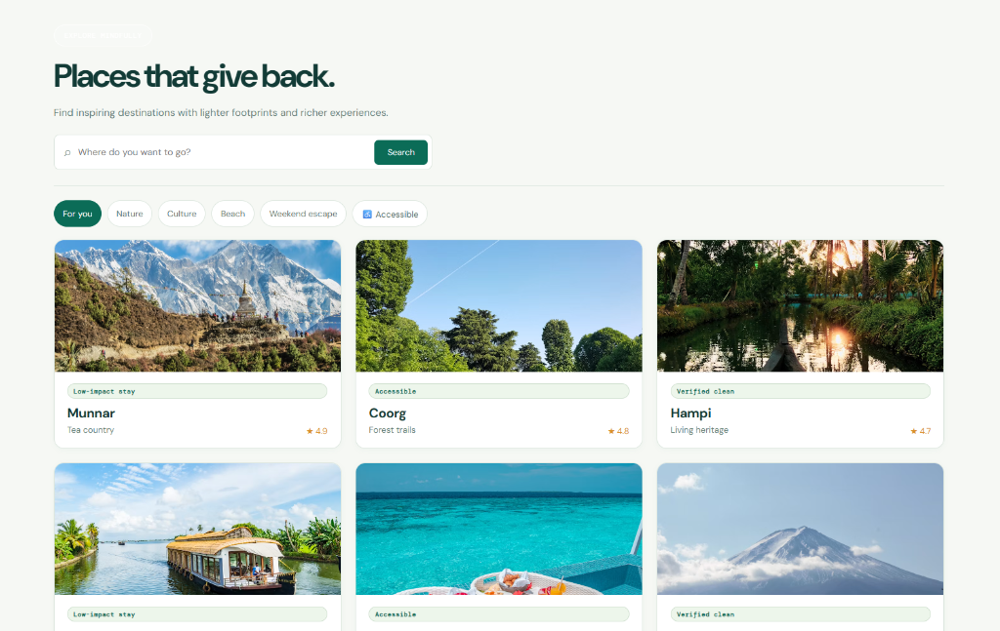
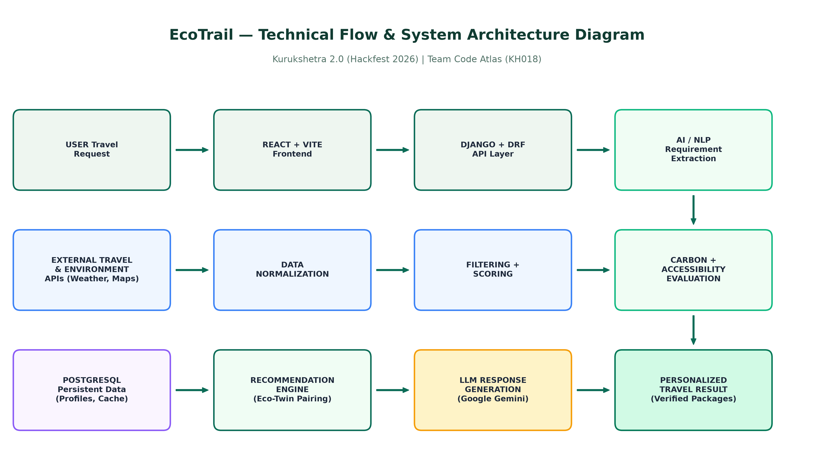
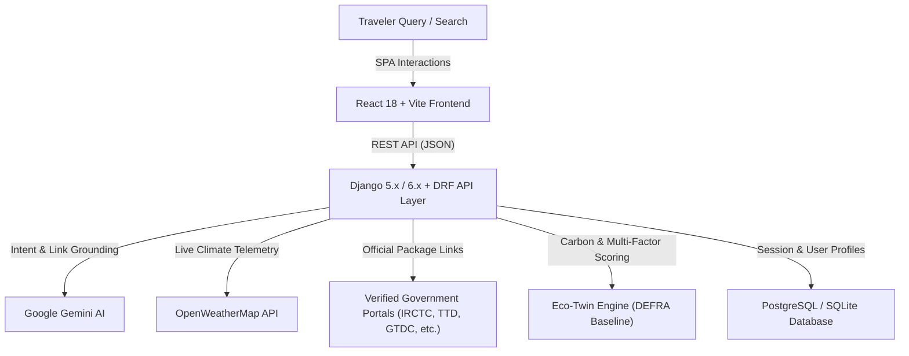

# 🌿 EcoTrail
### *Smart Sustainable & Accessible Hospitality Recommendation Platform*

<p align="center">
  
</p>

<p align="center">
  <strong>Kurukshetra 2.0 — HACKFEST 2026</strong><br/>
  <strong>Problem Statement:</strong> Green &amp; Inclusive Travel — Smart Sustainable and Accessible Hospitality<br/>
  <strong>Team ID:</strong> KH018 &nbsp;|&nbsp; <strong>Team Name:</strong> Code Atlas
</p>

<p align="center">
  <a href="#-project-overview"></a>
  <a href="#-tech-stack"></a>
  <a href="#-tech-stack"></a>
  <a href="#-tech-stack"></a>
  <a href="#-tech-stack"></a>
  <a href="LICENSE"></a>
</p>

---

## 📖 Table of Contents
- [Project Overview](#-project-overview)
- [The Problem We Solve](#-the-problem-we-solve)
- [Key Features & Innovations](#-key-features--innovations)
- [Interactive UI Showcase](#-interactive-ui-showcase)
- [System Architecture](#-system-architecture)
- [Technology Stack](#-technology-stack)
- [Repository Structure](#-repository-structure)
- [Getting Started](#-getting-started)
- [Configuration & Environment Variables](#-configuration--environment-variables)
- [Running Automated Tests](#-running-automated-tests)
- [Team Details](#-team-details)
- [License](#-license)

---

## 🌟 Project Overview

Planning a trip usually requires juggling disparate platforms for transport, accommodations, attractions, weather forecasts, and accessibility needs. Crucially, existing platforms prioritize high-margin flight packages and commercial tourist traps while hiding carbon footprints and middleman markups.

**EcoTrail** transforms travel planning into a holistic, **multi-factor decision-making experience**. Built specifically for **Kurukshetra 2.0 (Hackfest 2026)**, EcoTrail pairs destinations with **"Eco-Twins"**—sustainable, accessible alternatives that offer similar scenic and cultural wonders with:
1. **50% to 80% lower carbon footprints** (prioritizing electric rail, EV transit, and certified green homestays over domestic flights).
2. **First-class accessibility considerations** (wheelchair-accessible paths, step-free transit, and sensory ratings).
3. **Direct, zero-markup access to official government tour packages & portals** (e.g. TTD Tirupati Darshan, IRCTC Bharat Gaurav/Rail tours, GTDC Goa, KTDC Kerala, KSTDC Karnataka, RTDC Rajasthan, and ASI heritage tickets).

---

## 🎯 The Problem We Solve

| Challenge in Traditional Travel | EcoTrail Innovation |
| :--- | :--- |
| **High Emissions & Greenwashing** | Calculates genuine carbon footprints (DEFRA conversion factors) and recommends electric-rail Eco-Twins saving **40%–80% CO₂e**. |
| **Middleman Markups & Travel Fraud** | Connects travelers directly to verified, authentic government booking portals with zero agent commissions. |
| **Inaccessible Travel Data** | Profiles step-free routes, wheelchair boarding, and certified accessible stays for every journey. |
| **Static, Fragmented Feeds** | Dynamic debounced search with live OpenWeatherMap temperature and climate telemetry on every place card. |
| **Over-tourism at Fragile Sites** | Suggests regenerative community-first destinations that preserve biodiversity and support local artisans. |

---

## 💡 Key Features & Innovations

### 1. ⇄ The "Eco-Twin" Recommendation Engine
- Compares a requested commercial route (e.g. Mumbai → Goa via direct flight) with an intelligent, low-emission counterpart (e.g. scenic Konkan Railway electric rail + verified eco-stay).
- Evaluates routes across a multi-factor score:
  $$\text{Score} = w_1 \cdot \text{Carbon Reduction} + w_2 \cdot \text{Transit Ease} + w_3 \cdot \text{Accessibility} + w_4 \cdot \text{Cost Efficiency}$$
- Displays side-by-side metrics: CO₂ saved in kg, travel time, cost differences, and certified stays.

### 2. ⌕ Dynamic Real-Time Places Discovery (`/discover`)
- **Debounced Instant Search (280ms)**: As the traveler types any place globally (e.g. *Tirupati, Goa, Varanasi, Manali, Paris*), the UI dynamically queries the backend without requiring manual clicks or page reloads.
- **Live Weather Integration**: Displays live OpenWeatherMap temperature badges (`☀️ 29°C`, `🌧️ 21°C`) and humidity directly on place cards.
- **Official Package Highlights**: Flags destinations offering verified government packages (`⭐ Official Package`).
- **Interactive Snapshot Modal**: Clicking any card opens a deep-dive snapshot with live climate telemetry, green scores, verified government package links (`Access Official Package ↗`), and direct planner navigation.

### 3. 💬 Real-Time Agentic AI Travel Assistant
- Centered workspace modal powered by **Google Gemini** with strict grounding rules:
  - Answers open-ended travel questions with sub-second response times.
  - Automatically recommends and cites exact government package links from an authoritative registry.
  - Formats responses into structured symmetric cards (Transit Plan, Stay Suggestion, Cost Breakdown, Booking Action).

### 4. 🧭 7-Question Accessibility & Travel Profiler
- Conversational onboarding capturing landscape preferences, pace, budget, and accessibility needs.
- 27 bespoke vector SVG illustrations matching the brand palette with zero generic emojis.

---

## 📸 Interactive UI Showcase

<table align="center" width="100%">
  <tr>
    <td width="50%" align="center">
      <br/>
      <b>Landing Page &amp; Brand Philosophy</b>
    </td>
    <td width="50%" align="center">
      <br/>
      <b>How It Works: Enter Trip → Analyze → Eco-Twin</b>
    </td>
  </tr>
  <tr>
    <td width="50%" align="center">
      <br/>
      <b>Environmental Impact &amp; Community Savings</b>
    </td>
    <td width="50%" align="center">
      <br/>
      <b>Frequently Asked Questions</b>
    </td>
  </tr>
  <tr>
    <td width="50%" align="center">
      <br/>
      <b>Traveler Dashboard &amp; Coastal Scenic Hero</b>
    </td>
    <td width="50%" align="center">
      <br/>
      <b>Plan a Trip: Where to Next?</b>
    </td>
  </tr>
  <tr>
    <td colspan="2" align="center">
      <br/>
      <b>Real-Time Discover: "Places that give back" with Live Climate &amp; Official Government Packages</b>
    </td>
  </tr>
</table>

---

## 🏗️ System Architecture

<p align="center">
  
</p>



---

## 🛠️ Technology Stack

| Layer | Technologies / Services |
| :--- | :--- |
| **Frontend** | [React 18](https://react.dev/) (`18.3.1`), [Vite](https://vitejs.dev/) (`5.4.x`), [React Router](https://reactrouter.com/) (`v6.26.0`), Axios |
| **Styling & Design** | Pure **Vanilla CSS** (tailored design system, glassmorphism, soft sage `#e6efe6`, emerald `#0b6c57`, lime `#cce96d`), Custom SVG Vector Icons |
| **Backend** | [Python 3.11+](https://www.python.org/), [Django](https://www.djangoproject.com/) (`5.x` / `6.x`), [Django REST Framework (DRF)](https://www.django-rest-framework.org/) (`3.14+`), `django-cors-headers` |
| **Artificial Intelligence** | **Google Gemini** (`gemini-2.5-flash-lite`, `gemini-flash-latest`) via `google-genai` SDK with deterministic package-grounding fallbacks |
| **Real-Time Telemetry** | [OpenWeatherMap 2.5 API](https://openweathermap.org/api) with 10-minute in-memory caching |
| **Data & Conversion** | UK DEFRA / GHG Protocol emission conversion factors, OpenStreetMap / Overpass accessibility tags |
| **Authentication** | Firebase Client SDK (`11.0.0`) & Firebase Admin SDK (`7.0.0`) |
| **Database** | PostgreSQL (production) / SQLite3 (local development) |

---

## 📁 Repository Structure

```text
KH018-CodeAtlas/
│
├── README.md                      # Comprehensive interactive project documentation
├── LICENSE                        # Open-source MIT License
├── requirements.txt               # Backend Python dependencies
├── package.json                   # Frontend npm dependencies and scripts
├── .gitignore                     # Git ignore rules for Python, Node, and environments
│
├── src/                           # Complete project source code
│   ├── backend/                   # Django REST Framework application
│   │   ├── manage.py
│   │   ├── Project1/              # Core Django settings and URL router
│   │   ├── chat/                  # Gemini AI travel assistant & official packages registry
│   │   ├── travel/                # Real-time places discovery, weather & fallback resolver
│   │   ├── recommendations/       # Eco-Twin recommendation and scoring engine
│   │   ├── accessibility/         # Inclusivity profiling & barrier-free grading
│   │   ├── trips/                 # Saved itineraries and trip persistence
│   │   ├── myapp/                 # User profiles and Firebase auth bridge
│   │   └── .env.example
│   │
│   └── frontend/                  # React 18 + Vite Single Page Application (SPA)
│       ├── package.json
│       ├── index.html
│       ├── src/
│       │   ├── components/        # Reusable UI components (Navbar, Modal, Cards, Logo)
│       │   ├── pages/             # Pages (Home, Discover, Planner, Onboarding, Profile)
│       │   ├── context/           # React AuthContext and state providers
│       │   ├── services/          # API clients and trip services
│       │   └── styles.css         # Complete Vanilla CSS design system
│       └── .env.example
│
├── docs/                          # Project documentation and diagrams
│   ├── project-documentation.pdf  # Official Kurukshetra 2.0 technical submission form
│   ├── architecture.png           # High-resolution system architecture diagram
│   └── other-diagrams/            # Pipeline workflows and ranking matrices
│
├── screenshots/                   # High-resolution prototype screenshots
│   ├── screenshot-1.png           # Landing page hero
│   ├── screenshot-2.png           # How it works
│   ├── screenshot-3.png           # Impact metrics & ripple effect
│   ├── screenshot-4.png           # Frequently asked questions
│   ├── screenshot-5.png           # Overview dashboard
│   ├── screenshot-6.png           # Plan a trip form
│   └── screenshot-7.png           # Places that give back (Real-time discover)
│
└── data/                          # Dataset documentation and reference baselines
    └── README.md                  # Comprehensive guide to APIs, conversion factors & registries
```

---

## 🚀 Getting Started

### Prerequisites
- **Python**: `3.11` or higher
- **Node.js**: `18.x` or higher (`npm` included)
- **Git**

### 1. Clone the Repository
```bash
git clone https://github.com/sagarpc1006/Kurukshetra.git
cd Kurukshetra
```

### 2. Backend Setup (Django + DRF)
```bash
# Navigate to the backend directory
cd src/backend

# Create and activate a virtual environment
python -m venv venv
# On Windows:
venv\Scripts\activate
# On macOS/Linux:
source venv/bin/activate

# Install dependencies
pip install -r requirements.txt

# Run migrations
python manage.py migrate

# Start the Django development server
python manage.py runserver 127.0.0.1:8000
```
Backend API will be accessible at: `http://127.0.0.1:8000/`

### 3. Frontend Setup (React + Vite)
Open a new terminal window:
```bash
# Navigate to the frontend directory
cd src/frontend

# Install node dependencies
npm install

# Start the Vite development server
npm run dev
```
Frontend will be accessible at: `http://localhost:5173/`

---

## 🔐 Configuration & Environment Variables

Create `.env` files in `src/backend/` and `src/frontend/` using the provided `.env.example` templates:

### Backend (`src/backend/.env`)
```ini
DEBUG=True
SECRET_KEY=your-django-secret-key-here
ALLOWED_HOSTS=localhost,127.0.0.1

# Generative AI & Weather Telemetry
GEMINI_API_KEY=your_google_gemini_api_key
OPENWEATHERMAP_API_KEY=your_openweathermap_api_key

# Database (Leave blank for local SQLite)
DB_NAME=
DB_USER=
DB_PASSWORD=
DB_HOST=
DB_PORT=
```

### Frontend (`src/frontend/.env`)
```ini
VITE_API_BASE_URL=http://127.0.0.1:8000
```

---

## 🧪 Running Automated Tests

EcoTrail includes comprehensive test coverage across all apps, achieving a **100% pass rate**:

```bash
cd src/backend

# Run the complete test suite (119 test cases)
python manage.py test

# Run individual test suites
python manage.py test travel          # Real-time discovery & weather tests (6/6 OK)
python manage.py test chat.test_step9_e2e  # Real-time AI chat & package tests (9/9 OK)
python manage.py test myapp           # Authentication & preferences tests (17/17 OK)
```

---

## 👥 Team Details

**Kurukshetra 2.0 — Hackfest 2026**  
**Team ID:** `KH018`  
**Team Name:** `Code Atlas`

| Name | Role | Responsibilities |
| :--- | :--- | :--- |
| **Sagar Yadav** | Team Leader | System Architecture, Backend APIs, Cloud Deployment |
| **Yashraj Gadilkar** | Core Developer | Frontend Architecture, UI/UX Design System, Real-Time Discover Engine |
| **Aditya Kadam** | Core Developer | AI/NLP Grounding, Gemini Model Integration, Official Link Registry |
| **Chinmay Gaidhane** | Core Developer | Carbon Calculation Engine, Accessibility Metrics, Testing & Documentation |

---

## 📄 License

This project is licensed under the **MIT License** — see the [LICENSE](LICENSE) file for details.

---

<p align="center">
  <strong>🌿 Travel Today • Protect Tomorrow</strong><br/>
  <em>EcoTrail — Smarter Journeys. Lighter Footprints.</em>
</p>
